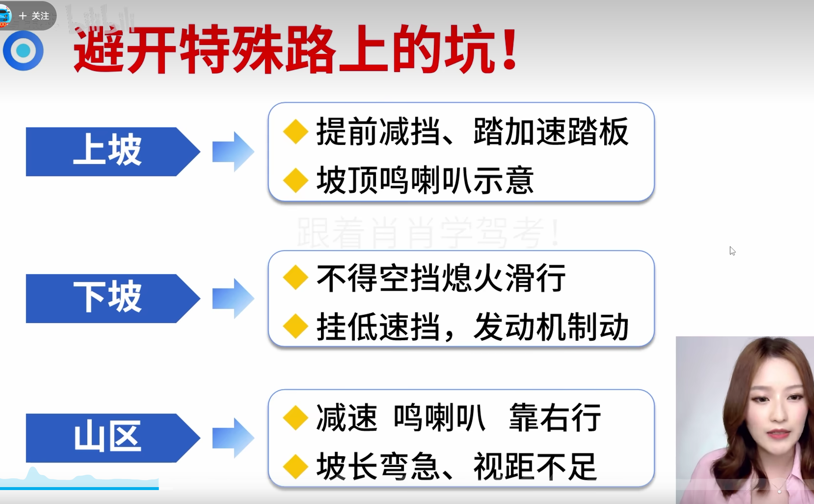
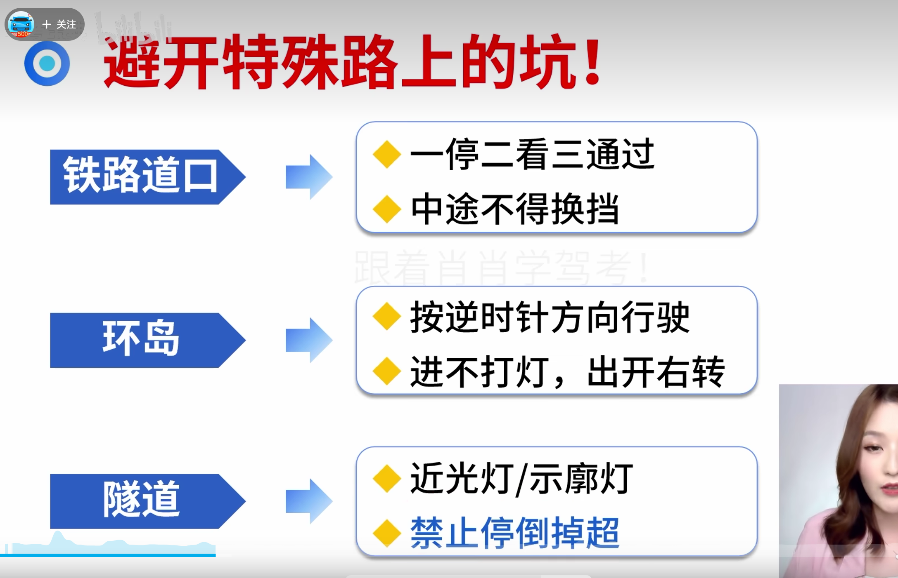
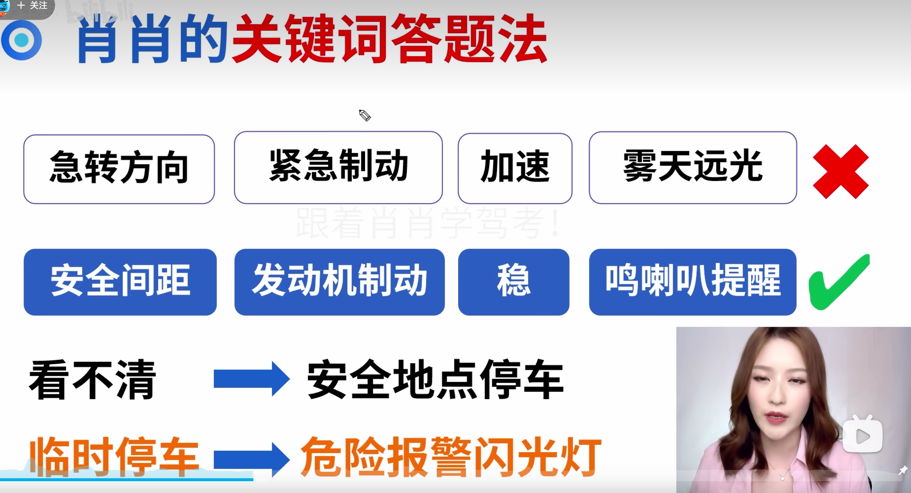
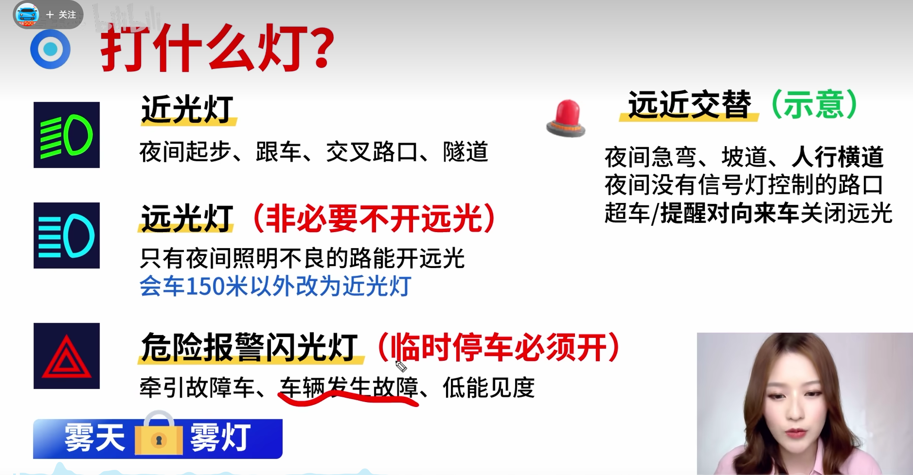
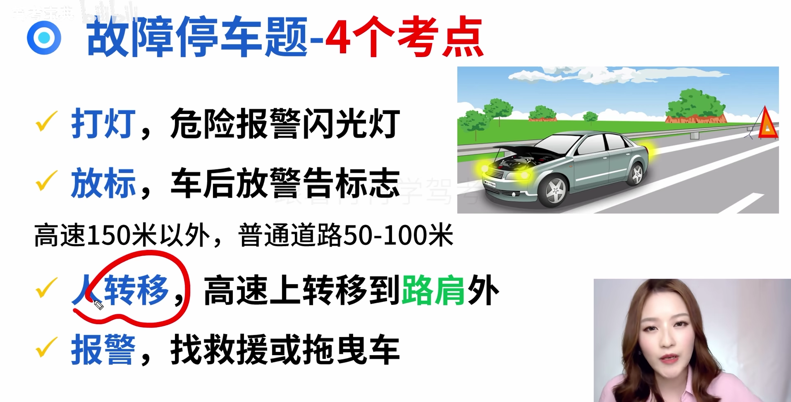
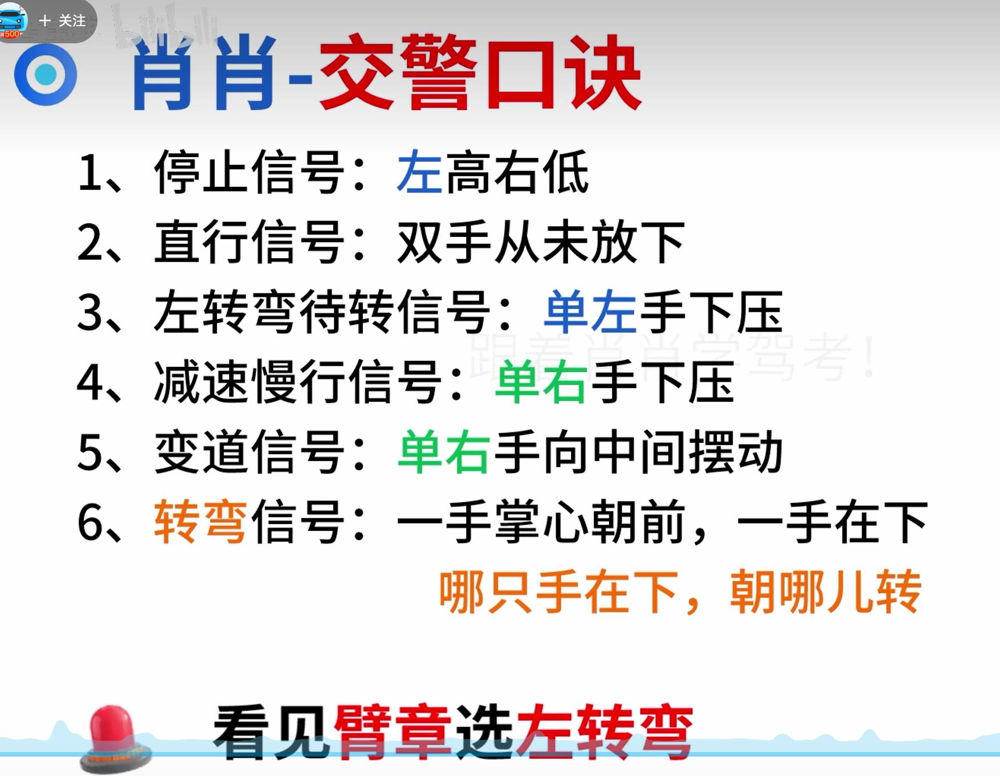
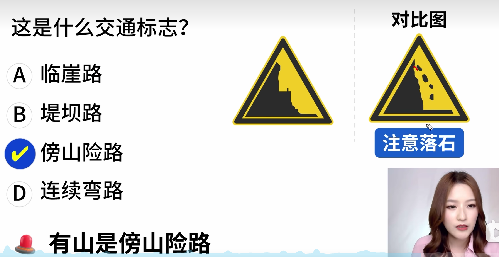

# 扣分

一分

- 会车
- 普倒掉
- 使用灯光
- 年检
- 安全带
- 禁令标志标线

三分

- 普逆
- 手持电话
- 高速低于最低速度
- 高速不按车道行驶
- 前方排队穿插占道
- 故障停车, 不按规定使用灯光或警告标识
- 三不让: 让行, 让行人,让校车

六分

- 应急车道
- 信号灯
- 暂扣期间驾驶
- 肇事逃逸, **不构成犯罪,**    **轻微伤**,财产损失 
- 危险爆炸平: 未挂警示标,进入限行区

九分

- 准驾车型不符
- 高速城快违法停车
- 无校车驾驶资格

十二分

- 饮酒
- 高倒掉逆
- 替人接受处罚
- 肇事逃逸, 轻伤以上或死亡, 不构成犯罪

灯光扣分

- 灯光1
- 故障灯光3
- 信号灯(闯红灯)6

号牌扣分:

- 不按规定安装3
- 未挂或故意遮挡9
- 伪造,变造12

超速扣分:

普通车:

- 超速20-50: 普路3分, 高速6分
- 超速50以上: 普路6分, 高速12分

校中危:

- 超速10-20: 普路1分,高速6分
- 超速20-50: 普路6分, 高速12分
- 超速50以上: 普路9分, 高速12分

超员扣分:

普通车

- 20-50: 七座以下3分, 以上6分
- 50-100: 七座以下6分, 以上9分
- 100以上: 12分

校公旅:

- 20以下: 6分
- 20以上: 12分

货车超载扣分:

- 30以下: 1分
- 30-50: 3分
- 50以上: 6分

# 罚款

200以下元:

- 转让 后,30日内未办理转让登记
- 车身
- 安检

20-200元:

- 补领新证用原证
- 实习期单独上高速
- 驾驶人信息变更30天内未备案
- 让撤不撤造成堵塞, 罚款200

200-500:

- 逾期不审验仍驾驶
- 身体不适合仍驾驶
- 隐瞒,欺骗补领驾驶证
- 公路客运超员未达20%(超过20%罚款500-2000)

200-2000并吊销驾驶证:

- 驾驶拼装,报废车
- 超速50%
- 把车交给无证人开
- 非法安装报警器

500元, 2000元:

- 虚假材料: 一年内不能申领, 500以下
- 考试贿赂: 考试贿赂,舞弊, 2000元

审验相关处罚:

- 弄虚作假: 1000以下
- 代替他人: 2000以下
- 组织他人: 3倍以下, 最高2万

代计分:

- 请他人代计分,处3倍以下罚款,最高不超过5万
- 组织代计分, 处5倍, 最高10万

酒驾扣分:

- 饮酒: 20-80mg/100ml, 暂扣驾驶证6个月,扣12分, 罚款1000-2000
- 再次饮酒: 吊销驾驶证, 拘留10日以下,罚款1000-2000
- 醉酒: >=80mg/100ml, 吊销5年
- 重大事故构成犯罪, 终生吊销

# 驾驶证

- 学习驾驶证明有效期3年
- c1: 30日预约科三, c2: 20日预约科三
- 科二, 科三预约次数分别不得超过5次

准驾车型:

c1, c2: 18岁以上

c3, c4: 18-60岁

A1, A2: 22-60岁

C6, A3, B1, B2: 20-60岁

驾驶证吊销

- 假一: 虚假材料申领未取得
- 吊二: 一般情形
- 撤三: 虚假材料申领取得, 撤销3年
- 醉五
- 逃终生: 肇事逃逸,构成犯罪

补证换证

- 车相关(号牌,行驶证): 登记地
- 人相关(驾驶证): 核发地, 核发地以外 

驾驶证审验:

- 需要审验:
  - 有效期满换证
  - 计分周期结束30日内
  - 延期审不超过3年
- 不需要审验
  - 机动车检验情况
  - 车辆累计里程

实习期:

- 不能单独上高速,需要3年以上老司机陪同
- 不可参加学法减分
- 实习期十二个月,挂实习标志
- 记满12分注销

时间相关:

- 驾驶证有效期: 6年-10年-长期
- 信息变更30日,有效期满90日

申请增加准驾车型:

- 轻型牵引挂车c6: c1, c2 1年
- 中型客车B1: c1 2年
- 大型客车A1: 大型货车B2 3年

机动车注册,变更登记

- 不能注册的:
  - 参数不符
  - 报废
  - 查封 扣押
  - 盗抢骗
- 需要变更登记的:
  - 改变车身颜色
  - 改变车架
  - 发动机
  - 更换整车

**加装防撞不用变更登记**

满分教育(扣满分之后学):

- 满12分: 法规(科一)
- 满24分: 法规,道路(科三)
- 满36分: 法规, 场地(科二), 道路

满12分学7天, 每加12分多七天, 最多60天

学法减分(未扣满分, 最高能减6):

- 公益111: 1小时1分
- 现场112: 一小时2分
- 网上331: 30分钟1分

# 责任判定

**危险驾驶罪**(未造成事故): 追逐竞驶, 醉驾, 处拘役并处罚金

**交通肇事罪**(发生事故): 酒驾毒驾, 无牌报废, 肇事逃逸, 判刑

赔偿责任

- 车对车:
  - 故意伪造现场: 全责
  - 货车散落货物导致后车装上: 货车全责
- 车对人:
  - 车无措:车承担不超过10%的赔偿
  - 车静止,人故意: 车不赔偿

判刑判几年

- 未逃逸: 3年以下
- 死亡后逃逸: 3-7年
- 逃逸导致死亡: 7年以上

# 通行原则

# 复杂路段

# 特殊天气

# 速度专项

# 灯光仪表

# 事故处理

# 现场急救

# 信号灯

# 交警手势

# 标志

# 标线

